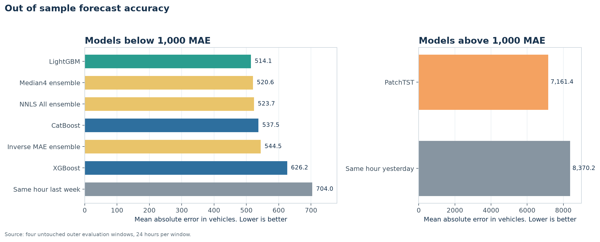
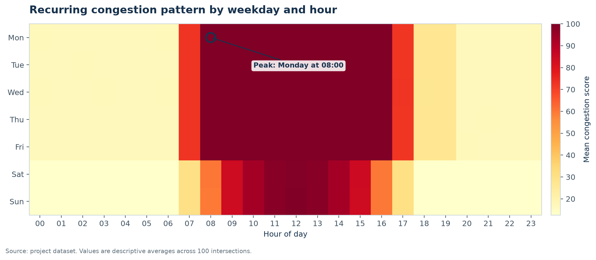
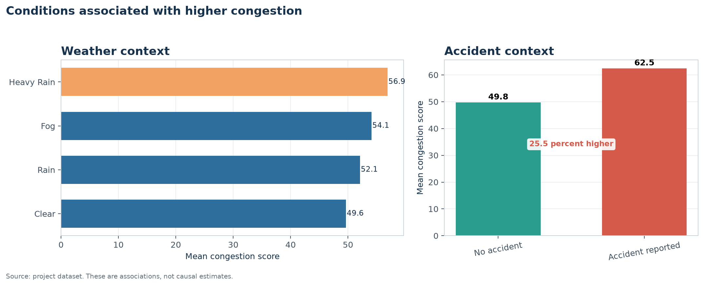
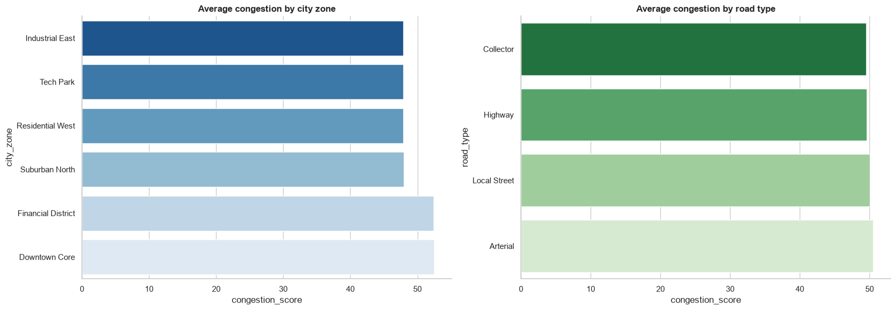
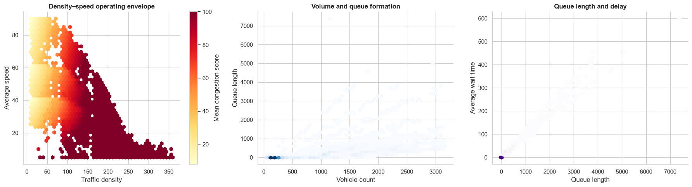
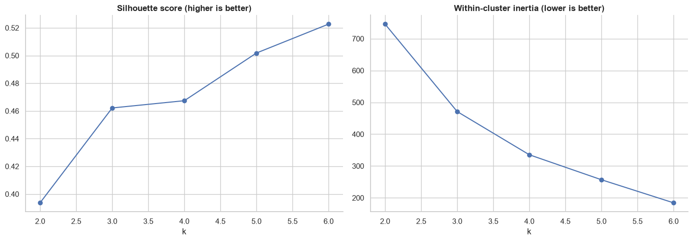
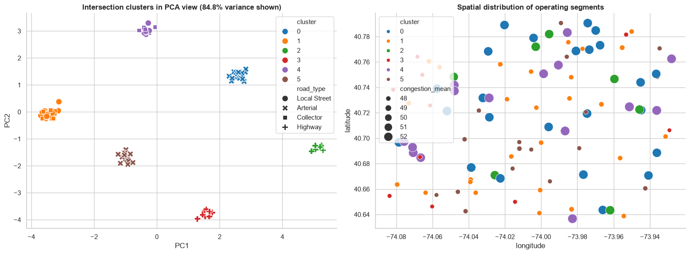
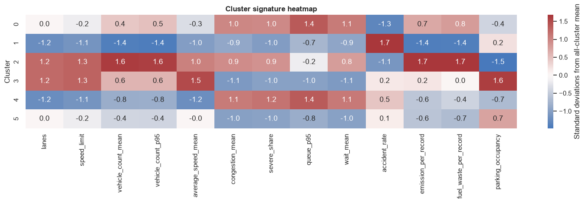
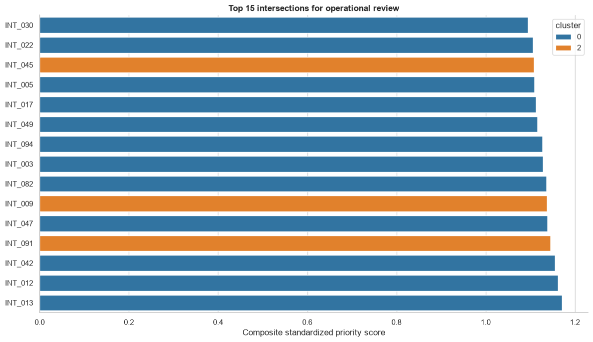

# 🚦 Smart City Traffic and Urban Mobility Modeling

This project explains urban traffic patterns and forecasts total citywide vehicle demand from 1 to 24 hours ahead. It combines exploratory analysis, intersection clustering, time series validation, model tuning, ensemble testing, and production style inference.

The dataset and sensor network are simulated. The project demonstrates a rigorous analytical workflow, not measured performance in a real city.

## 🏆 Final results at a glance

LightGBM was the best forecasting model. It achieved a mean absolute error, or MAE, of 514.1 vehicles across four untouched evaluation windows. This was approximately 27 percent better than predicting the same hour from the previous week.

| Method | MAE | Main takeaway |
|---|---:|---|
| LightGBM | 514.1 | Best overall model |
| Median4 ensemble | 520.6 | Best ensemble |
| CatBoost | 537.5 | Strong tree model |
| XGBoost | 626.2 | Better than the weekly baseline |
| Same hour last week | 704.0 | Strong seasonal baseline |
| PatchTST | 7,161.4 | Neural model struggled with the short series |
| Same hour yesterday | 8,370.2 | Weakest seasonal baseline |



Lower MAE is better. LightGBM provided the strongest balance of accuracy, speed, interpretability, and deployment simplicity. The transformer result is specific to this experiment and does not mean that transformers are generally poor forecasting models.

## 🧭 What the project covers

The work answers three practical questions.

1. When and where does congestion become most severe.

2. Which traffic, weather, and incident conditions are associated with congestion.

3. Which model most accurately forecasts citywide vehicle count for the next 24 hours.

The analysis includes data quality checks, temporal and spatial exploration, six intersection operating clusters, seasonal forecasting baselines, three gradient boosted tree models, PatchTST, Optuna tuning, ensemble methods, saved model files, and a batch forecasting program.

## 📊 Dataset

| Item | Value |
|---|---:|
| Records | 204,000 |
| Intersections | 100 |
| Hourly timestamps | 2,040 |
| Fields | 47 |
| Coverage | 1 January 2026 to 26 March 2026 |

The fields describe traffic volume, speed, queues, delay, road design, weather, incidents, public activity, signal timing, emissions, fuel waste, and congestion.

The data form a complete hourly panel. Every timestamp contains all 100 intersections. No missing values, duplicated identifiers, or duplicated intersection and timestamp pairs were found. This is much cleaner than a typical live traffic system.

## 🔍 Main exploratory findings

The highest recurring congestion occurred on Monday at 08:00. Weekday congestion rose sharply during the morning and remained elevated through the afternoon. Weekend traffic increased later and changed more gradually.



Downtown Core had the highest zone average congestion score, approximately 52.5. Heavy Rain had the highest weather group average, approximately 56.9, compared with 49.6 during clear weather.

Records with a reported accident had an average congestion score of 62.5. Records without an accident averaged 49.8. This represents a descriptive difference of approximately 25.5 percent.



These comparisons show association, not causation. Weather and accident groups may also differ by location, hour, demand, or other conditions.

Average congestion was similar across road types, but it varied more clearly across city zones. Downtown Core and Financial District had the highest averages. This suggests that location and surrounding activity may matter more than the road category alone.



Traffic density, speed, queues, and delay also moved together in recognizable ways. Higher density was associated with lower speed and higher congestion. Queue length and average waiting time showed a particularly strong positive relationship.



## 🧩 Intersection clustering

Each intersection was summarized with 13 long term operating features. These covered road capacity, traffic demand, speed, congestion, severe congestion share, queues, waiting time, accident rate, emissions, fuel waste, and parking occupancy. The features were standardized before K means clustering so variables with larger units could not dominate the solution.

Solutions from two through six clusters were compared. Six clusters achieved the highest silhouette score, approximately 0.52, while also reducing within cluster variation.



The PCA view below preserves 84.8 percent of the variation in the standardized intersection features. It shows clear separation among operating profiles. The map on the right shows that the profiles are distributed across the simulated city rather than forming one simple geographic block.



The cluster signature heat map explains what separates the groups. Red cells indicate values above the average cluster profile. Blue cells indicate values below it.



Clusters 0 and 4 show high congestion, severe congestion share, queues, and waiting time. Cluster 2 carries the highest traffic volume, emissions, and fuel waste. Cluster 3 combines higher road capacity and speed with lower congestion and delay. These profiles are descriptive segments, not predictions or causal explanations.

The priority score combines congestion, upper queue length, waiting time, severe congestion share, emissions, and fuel waste. The highest ranked locations were INT_013, INT_012, INT_042, INT_091, and INT_047.



The ranking is a screening tool. It helps decide where to investigate first, but field evidence is required before changing signals, road design, staffing, or enforcement.

## 🧠 Forecasting approach

Vehicle counts from all 100 intersections were summed into one citywide hourly series. Each model predicts the next 24 hourly totals.

The tree models use 34 transparent features. These include the previous 24 hourly values, longer lags at 48, 72, 168, and 336 hours, future calendar information, and forecast horizon.

Realized future weather, accidents, congestion, and speed were excluded because they would not be known when a forecast is issued. This prevents information leakage and makes the evaluation more realistic.

PatchTST uses the previous 168 hourly values and predicts all 24 horizons directly. It was included as a modern transformer benchmark that could be trained locally. It is not presented as the newest or universally best time series transformer.

## 🧪 Validation and tuning

Time order was preserved throughout the project. Random splitting was not used.

Three earlier 24 hour windows were used for Optuna tuning and ensemble weighting. Four later 24 hour windows were kept untouched for final evaluation. Each fold used an expanding history, so every model learned only from observations available before its forecast origin.

LightGBM, XGBoost, and CatBoost received eight Optuna trials each. PatchTST received five trials, 60 training steps during tuning, and 200 steps during final evaluation. These budgets were chosen to keep the notebook practical on a laptop. They are not exhaustive searches.

The final comparison also tested equal mean, median, inverse error weighting, and nonnegative least squares ensembles. All ensemble rules were learned before the final evaluation windows.

MAE was the main selection metric because it can be read directly in vehicles. RMSE, symmetric percentage error, weighted percentage error, and scaled error were included for additional context.

## 💡 Why LightGBM won

The citywide series contains only 2,040 hourly observations but has strong hourly and weekly structure. LightGBM can learn these patterns efficiently from explicit lag and calendar features.

PatchTST had less useful training information for this setting. Its weaker result likely reflects the short single series, modest neural tuning budget, abrupt rush hour changes, and lack of explicit future calendar inputs. A transformer may become more competitive with longer history, several random seeds, more tuning, and global training across all 100 intersection series.

The practical conclusion is that model complexity should be earned through validation. In this experiment, the simpler tree model was both more accurate and easier to operate.

## 📁 Project structure

| Location | Purpose |
|---|---|
| `notebooks/01_smart_city_traffic_EDA_and_clustering.ipynb` | Data validation, EDA, hotspot analysis, and clustering |
| `notebooks/02_smart_city_traffic_24h_forecasting_GBDT_vs_PatchTST.ipynb` | Initial forecasting design and model comparison |
| `notebooks/03_tuned_PatchTST_LightGBM_XGBoost_CatBoost_ensembles.ipynb` | Optuna tuning, final evaluation, ensembles, and diagnostics |
| `models/` | Saved LightGBM, XGBoost, CatBoost, and PatchTST bundles |
| `04_lightgbm_production_forecaster.py` | Production style batch forecasting program |

All three notebooks were executed from beginning to end. Their final runs contained no failed cells, unexecuted code cells, or embedded tracebacks.

## ▶️ How to reproduce the work

Use Python 3.10 or newer. Install the libraries listed in the notebooks, including pandas, Polars, Matplotlib, Seaborn, scikit learn, Optuna, LightGBM, XGBoost, CatBoost, PyTorch, NeuralForecast, and joblib.

Place `smart_city_traffic_mobility.csv` in the project data location, or update `DATA_CANDIDATES` near the beginning of each notebook. Run the notebooks in numeric order.

## 🚀 Production inference

The LightGBM forecasting program validates the input schema, timestamps, duplicates, intersection completeness, feature order, and simple drift indicators. It then creates the next 24 hourly forecasts and writes CSV or JSON output safely.

```bash
python 04_lightgbm_production_forecaster.py \
  --input data/smart_city_traffic_mobility.csv \
  --output forecast.csv
```

The input must contain at least 336 consecutive recent hours for all 100 intersections. Partial panels are rejected because missing intersections would bias the citywide total.

The saved production bundle was retrained on all 2,040 hours. Its forecasts matched the final notebook values within 0.001 vehicles. The XGBoost, CatBoost, and PatchTST bundles were also reloaded successfully and reproduced their saved forecasts within 0.001.

Only load joblib files from trusted sources. Deserialization can execute code.

## ⚠️ Limitations

| Limitation | Why it matters |
|---|---|
| Simulated data | Patterns may be cleaner and more regular than traffic in a real city |
| Only 85 days of history | Seasonal changes, holidays, and long term shifts are not well represented |
| Four final forecast origins | The comparison contains 96 predictions per method and cannot establish year round reliability |
| Citywide aggregation | A good total forecast can hide serious errors at individual intersections |
| Modest Optuna budgets | Tree models and PatchTST may not have reached their best possible settings |
| Unequal feature information | Tree models received future calendar features, while PatchTST used only past target values |
| Fixed cluster search range | Six was the best tested value and also the largest candidate, so larger solutions remain unexplored |
| Static intersection summaries | Clusters describe long term averages and do not capture changing daily operating regimes |
| Descriptive comparisons | Weather, accident, and location differences do not establish causal effects |
| No calibrated uncertainty | Point forecasts do not quantify the probability of unusually high or low traffic |

The congestion score also reaches its upper boundary frequently during busy hours. This compression can hide differences among already severe conditions. Real deployment would require evaluation on raw operational measures and independently verified outcomes.

## 🔭 Recommended next steps

1. Evaluate daily forecast origins across at least one full year, including holidays, weather events, and seasonal changes.

2. Train a global model across all 100 intersection series, then reconcile intersection forecasts with the citywide total.

3. Add calibrated prediction intervals using rolling conformal methods and evaluate their coverage by forecast horizon.

4. Give all model families the same information, including future calendar fields and genuinely available weather or event forecasts.

5. Test more cluster counts, repeat clustering across random seeds and resamples, and measure how stable each intersection assignment remains.

6. Replace static clusters with daily or weekly operating regimes that can change over time.

7. Validate the complete workflow on a real public traffic dataset with realistic missing records and sensor failures.

8. Add automated tests, dependency locking, an API, Docker support, continuous integration, and ongoing drift monitoring.

## ✅ Conclusion

This project shows that careful validation matters more than model novelty. LightGBM produced the most accurate 24 hour forecasts, improving MAE by approximately 27 percent over the weekly seasonal baseline. The exploratory analysis also identified clear temporal, spatial, weather, and incident patterns that can guide further study.
